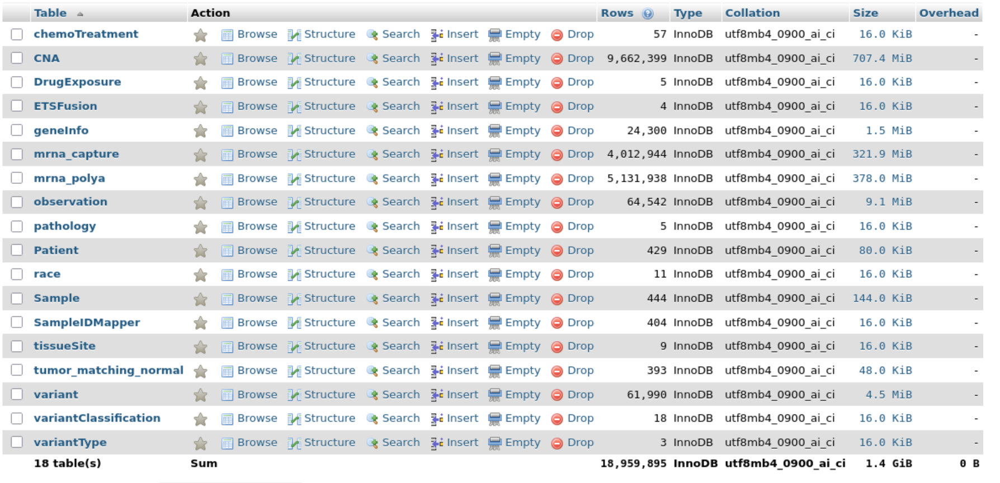
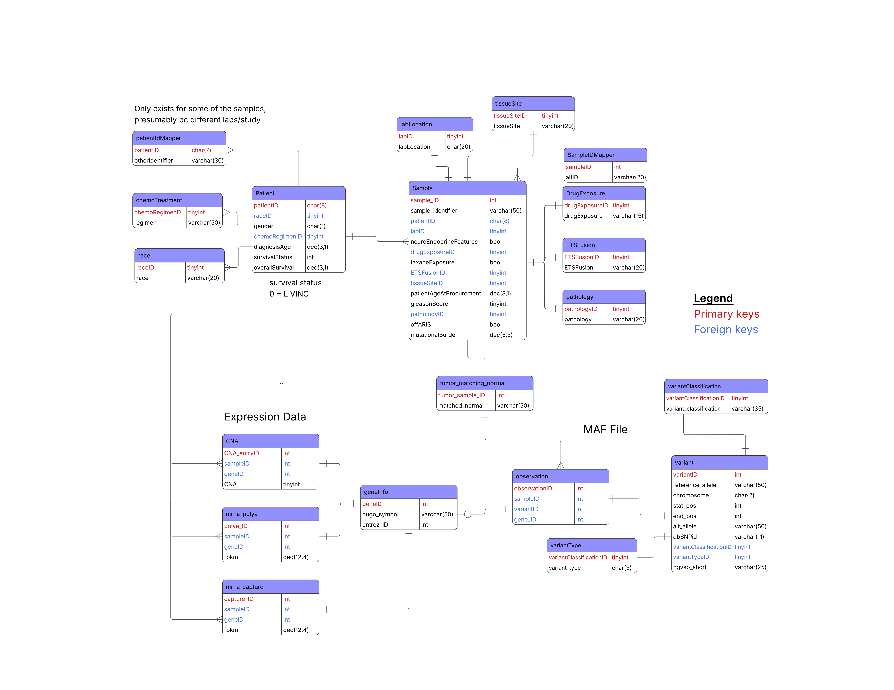

# GU_database_project

## Project Summary

This project was constructed to give experience with cosntructing a database, perform data cleaning, and implemmenting design decisions that shape how the databse is uesd. The overall goal of the databse is to investigate "interesting" mutations and gneomic events from a cBioPortal study.

## Tools and Technologies
- DBMS: MySQL
- Python (v3.13.5)

## Repository structure
- *Scripts* contain the Python scripts that were used to clean the raw data and generate the SQL insert commands to populate the data into the database.
- *sql* contains the SQL scripts to create the databse.
- *data* contains the data stored in the databse
- *docs* contains additional information about the databse, including rationale, database design choices, limitations, and the data dictionary of the databse tables.
- *diagrams* contatins the representation of the normalized form of the database.


## Data Source
The raw data used in this study was obtained from cBioPortal, study name: [Metastatic Prostate Adenocarcinoma (SU2C/PCF Dream Team, PNAS 2019)] (https://www.cbioportal.org/study/summary?id=prad_su2c_2019 "link to study in cBioPortal"), PMID: [31061129](https://pubmed.ncbi.nlm.nih.gov/31061129/ "link to original paper").

## How to Recreate the Database
The most effective method to recreate the databse is to create an empty database and populate it with the [mydump.sql](sql/mydump.sql) file from the command line.

```
mysql -u root -p
CREATE DATABASE project;
USE project;
source mydump.sql
```

This will create tables and populate the database, as shown below


Alternatively, the Python and resulting SQL scripts could be run in the order listed in the [script execution file](docs/script_execution.md) if you wish to start from the raw data.

## Documentation and Diagrams



The database was constructed to follow the design shown above. The databse was normalized as far  as practically needed, with deliberate deviations and design choices detailed in the [write up document](docs/write-up.docx). 
